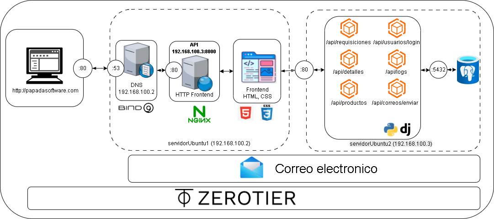
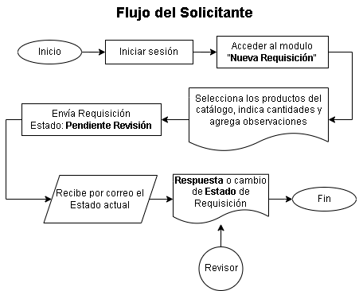
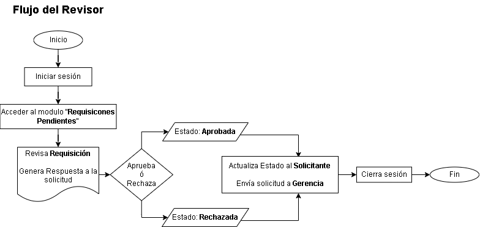
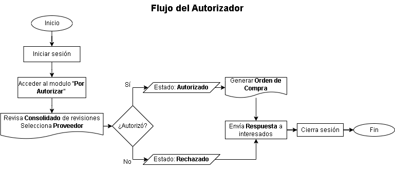
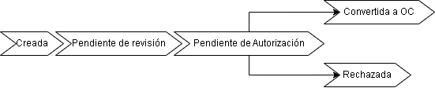

# Sistema de Gestión de Requisiciones – Proyecto Redes

Sistema distribuido basado en microservicios para la gestión de requisiciones, desarrollado con Django REST Framework, PostgreSQL y frontend servido mediante Nginx.


## Descripción

Este proyecto implementa una arquitectura cliente-servidor distribuida en dos máquinas virtuales:

- servidorUbuntu1 → Frontend + Nginx + DNS (Bind9)
- servidorUbuntu2 → Backend (Django REST) + PostgreSQL


## Arquitectura del Sistema



---

## Flujo del Sistema

### Flujo del Solicitante



---

### Flujo del Revisor



---

### Flujo del Autorizador



---

### Ciclo de Vida de la Requisición



---

## Tecnologías

### Frontend (servidorUbuntu1)
- HTML5
- CSS3
- JavaScript (Fetch API)
- Nginx
- Bind9

### Backend (servidorUbuntu2)
- Python 3.12
- Django REST Framework
- PostgreSQL
- SMTP Gmail
- python-dotenv

---

## Cómo levantar el ambiente

### 1. Requisitos

- VirtualBox
- Ubuntu 24.04
- Python 3.12
- PostgreSQL
- Nginx

---

### 2. Clonar repositorio

```bash
git clone https://github.com/JheffreyUrbano/proyecto-redes.git
cd proyecto-redes
```

### 3. Backend
```bash
cd backend
python -m venv venv
source venv/bin/activate
pip install -r requirements.txt
```

### 4. Variables de Entorno
```bash
EMAIL_HOST_USER=tu_correo@gmail.com
EMAIL_HOST_PASSWORD=tu_password
```

### 5. Ejecutar Backend
```bash
python manage.py runserver 0.0.0.0:8000
```

### 6. Configurar Nginx
```bash
server {
    listen 80;
    server_name papadasoftware.com;

    root /home/urbano/servidorUbuntu1/frontend/app;
    index index.html;

    location / {
        try_files $uri $uri/ /index.html;
    }

    location /api/ {
        proxy_pass http://192.168.100.3:8000;
    }
}
```

### Endpoints API
http://papadasoftware.com/api/


#### Requisiciones
  - GET /api/requisiciones/
  - POST /api/requisiciones/
  - DELETE /api/requisiciones/{requino}/


#### Detalles
  - GET /api/detalles/
  - GET /api/detalles/?requino=ID
  - DELETE /api/detalles/eliminar/

```json
{
  "item": 1,
  "codproducto": "MP-MAD-001",
  "requino": "000001"
}
```

#### Logs
    - GET /api/logs/?requino=ID
    - POST /api/logs/

#### Correos
    -POST /api/correos/enviar/

### Flujo del sistema
    1. Usuario accede a papadasoftware.com
    2. DNS resuelve a 192.168.100.2
    3. Nginx sirve frontend
    4. Frontend consume API
    5. Django procesa lógica
    6. PostgreSQL guarda datos
    7. SMTP envía correos

### Seguridad
- Backend no expuesto directamente
- Uso de variables de entorno
- Proxy inverso con Nginx
- Logs inmutables

### Estado del proyecto
- API funcional
- Frontend operativo
- Correos integrados
- Auditoría implementada
- Arquitectura distribuida


## Authors

- [@JheffreyUrbano](https://www.github.com/JheffreyUrbano)
- [@AlexanderMosquera](https://github.com/alexelgordo72)

## License

[GNU AGPL v3 License](https://github.com/JheffreyUrbano/proyecto-redes/blob/main/LICENSE)

